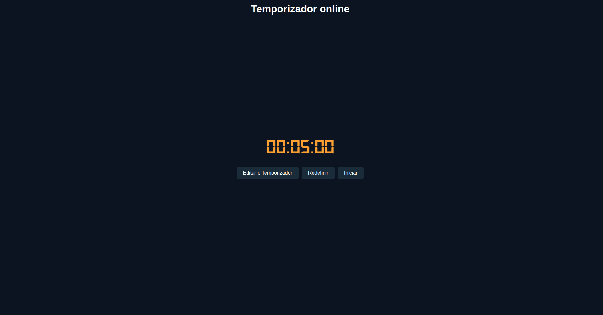
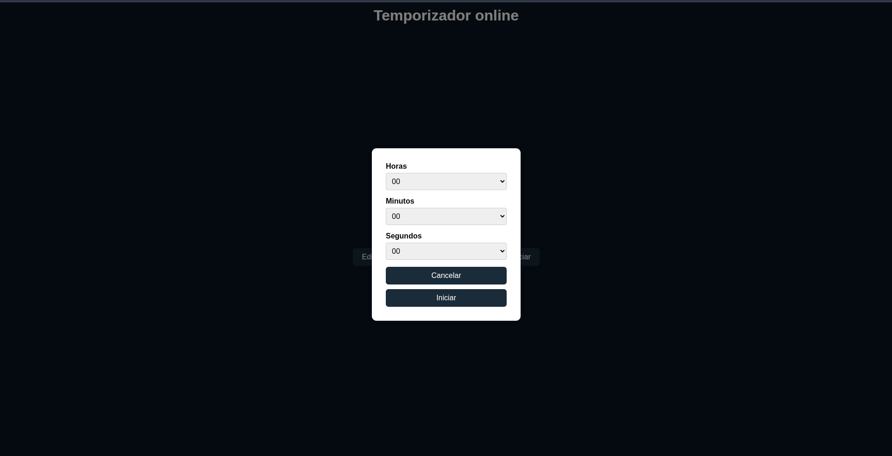

# ⏱️ Temporizador Online

Este é um projeto simples de **temporizador online** desenvolvido com **HTML**, **CSS** e **JavaScript**, com foco em entender **a separação de responsabilidades entre arquivos e pastas**.

## 🎯 Objetivo

O principal objetivo deste projeto foi aprender sobre a **organização de código** em projetos web, separando corretamente:

- Lógica em módulos (`JavaScript`)
- Estilo visual (`CSS`)
- Estrutura HTML (`index.html`)
- Recursos externos como fontes personalizadas (`fonts/`)

Além disso, o projeto conta com **estilização personalizada** usando uma **paleta de cores** inspirada em tons sóbrios e modernos.

---

## 🗂️ Estrutura de Pastas

```
📦 projeto-temporizador/
├── index.html              # Estrutura principal da aplicação
├── css/
│   └── style.css           # Estilos visuais da aplicação
├── fonts/
│   └── DS-DIGI.TTF         # Fonte digital usada no cronômetro
├── js/
│   ├── main.js             # Script principal com manipulação de eventos e DOM
│   ├── helpers/
│   │   └── helpers.js      # Funções auxiliares (ex: preencher selects, abrir/fechar modal)
│   └── modules/
│       └── timer.js        # Lógica do cronômetro (start, pause, reset)
```

## 🚀 Funcionalidades

- ⏱️ Iniciar cronômetro com tempo padrão ou personalizado
- ⏸️ Pausar e continuar
- ♻️ Redefinir para o tempo inicial
- 🛠️ Modal para configurar tempo manualmente (horas, minutos, segundos)

---

## 📚 Aprendizados

✔ Separar responsabilidades por arquivos ajuda na **manutenção e legibilidade**  
✔ Componentização simples com **funções modulares**  
✔ Utilização de **setInterval** e controle de tempo em JS  
✔ Trabalhar com **eventos e manipulação do DOM**

---

## 📌 Requisitos

Nenhum. Basta abrir o `index.html` em um navegador moderno.

---

---

# 📷 Imagens



### ➕ Página de Adição de Produtos


